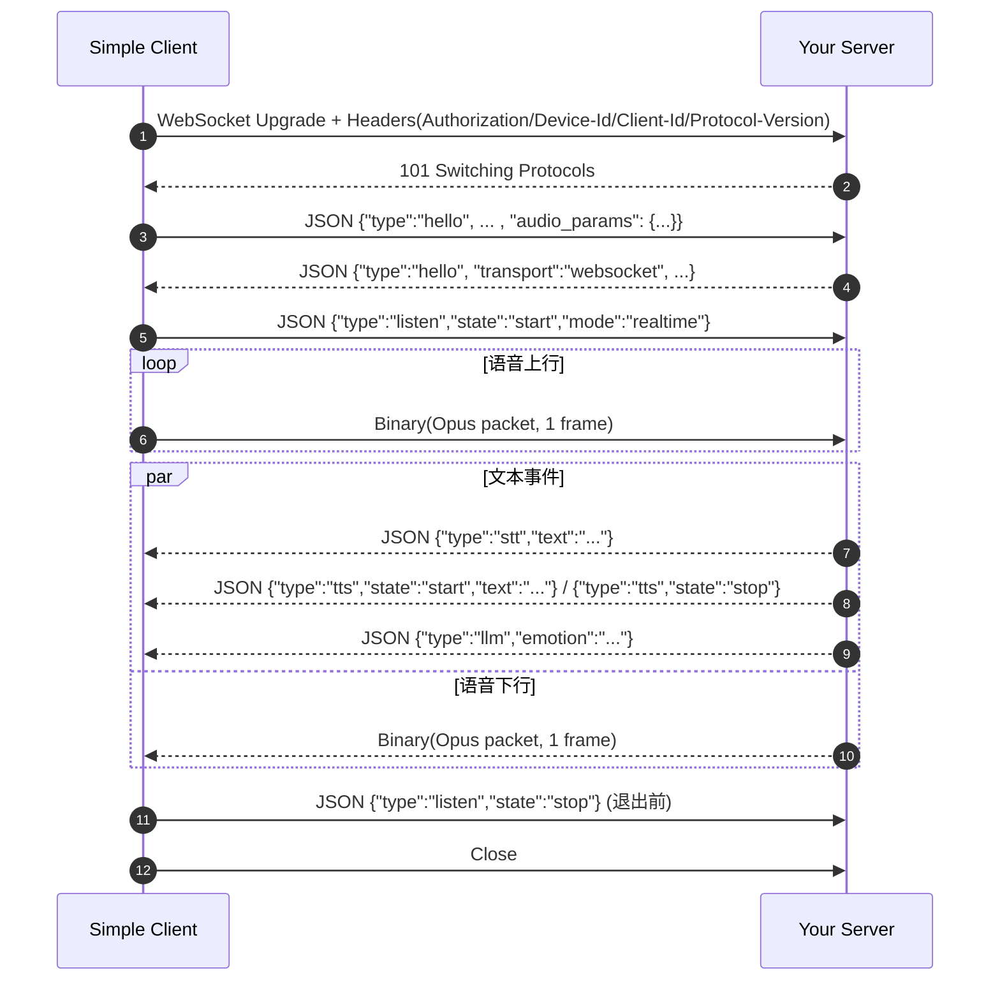

## simple-xiaozhi

### Simple Client（`src/simple_xiaozhi/simple_client`）通讯时序（WebSocket）

这份文档描述 `SimpleClientApp` + `WebSocketClient` 的**最小通讯子集**，用于你实现自己的服务端时对齐协议与时序。

> 代码入口参考：`src/simple_xiaozhi/simple_client/app.py`、`src/simple_xiaozhi/simple_client/ws_client.py`、`src/simple_xiaozhi/simple_client/audio.py`

---

## 1. 连接与鉴权

### 1.1 WebSocket URL

- 从环境变量或配置读取（见 `src/simple_xiaozhi/simple_client/config.py`）：
  - `XIAOZHI_WS_URL`
  - `XIAOZHI_ACCESS_TOKEN`
  - `XIAOZHI_DEVICE_ID`
  - `XIAOZHI_CLIENT_ID`

### 1.2 连接请求 Header

客户端在握手阶段附带以下 Header（见 `WebSocketClient.connect()`）：

```http
Authorization: Bearer <access_token>
Protocol-Version: 1
Device-Id: <device_id>
Client-Id: <client_id>
```

服务端建议：
- 校验 `Authorization`（或按你自己的方式鉴权）。
- 至少容忍并忽略未知 Header（便于后续扩展）。

### 1.3 WebSocket 连接参数（客户端侧）

客户端连接参数（见 `WebSocketClient.connect()`）：
- `ping_interval=20`、`ping_timeout=20`（需要服务端按 RFC 自动回复 `ping/pong`）
- `max_size=10 * 1024 * 1024`（单帧最大 10MB）
- `compression=None`（禁用压缩）
- `wss://` 时使用“不校验证书”的 SSL context（自建服务端用自签证书也能连上）

---

## 2. 数据通道：JSON 与音频二进制

同一条 WebSocket 连接上复用两种消息：

- **Text frame**：JSON（utf-8 字符串），用于控制/事件（hello、listen、stt、tts 等）。
- **Binary frame**：原始 Opus 包（`bytes`），用于语音上行/下行。

客户端接收逻辑（见 `WebSocketClient._receiver_loop()`）：
- 收到 `str`：`json.loads()` 后交给 `on_json` 回调。
- 收到 `bytes`：交给 `on_audio` 回调（通常就是播放）。

---

## 3. 典型会话时序（最小实现）

### 3.1 时序图



### 3.2 关键时序要求

- `hello` 往返：客户端发送 `hello` 后会等待服务端回 `type=hello`，**超时 10s**（见 `WebSocketClient.handshake()`）。
- `listen/start`：握手成功后客户端发送 `listen` 开始监听，然后开始发音频二进制帧（见 `SimpleClientApp.run()`）。
- `listen/stop`：客户端关闭前会尝试发送 `{"type":"listen","state":"stop"}`。

---

## 4. JSON 消息（最小字段约定）

### 4.1 Client -> Server：`hello`

客户端发送：

```json
{
  "type": "hello",
  "version": 1,
  "features": {"mcp": true},
  "transport": "websocket",
  "audio_params": {
    "format": "opus",
    "sample_rate": 16000,
    "channels": 1,
    "frame_duration": 20
  }
}
```

说明：
- `audio_params` 描述的是**上行麦克风音频**编码参数（见 `ws_client.py` 使用 `AudioConfig.INPUT_*`）。
- `frame_duration` 单位是毫秒；实际值可能是 `20` 或 `60`（由 `AudioConfig.FRAME_DURATION` 决定），服务端应以客户端发送的值为准。

### 4.2 Server -> Client：`hello`

客户端只要求 `type == "hello"` 就算握手成功（见 `WebSocketClient._handle_text()`）。

为了兼容本项目的另一套 `WebsocketProtocol` 实现，建议服务端回包至少包含：

```json
{
  "type": "hello",
  "transport": "websocket",
  "version": 1
}
```

### 4.3 Client -> Server：`listen`

开始监听（默认 `realtime`）：

```json
{"type":"listen","state":"start","mode":"realtime"}
```

停止监听（退出前发送）：

```json
{"type":"listen","state":"stop"}
```

### 4.4 Server -> Client：`stt` / `tts` / `llm`（Simple Client 会打印/展示）

`SimpleClientApp` 对这三类会做特殊打印（见 `src/simple_xiaozhi/simple_client/app.py`）：

```json
{"type":"stt","text":"用户说的话（可增量）"}
```

```json
{"type":"tts","state":"start","text":"准备播报的文本（可选）"}
```

```json
{"type":"tts","state":"stop"}
```

```json
{"type":"llm","emotion":"neutral"}
```

其他 `type` 客户端会原样打印整包 JSON，便于你扩展。

---

## 5. 音频二进制帧（Opus）

### 5.1 上行（Client -> Server）

- 在发送 `listen/start` 之后，客户端会不断发送 `bytes`。
- 每个 WebSocket binary message 对应**一帧** Opus 编码后的 packet（无额外自定义包头）。
- PCM 基准参数（由 `hello.audio_params` 给出）：
  - `sample_rate=16000`
  - `channels=1`
  - `frame_duration`：毫秒

你在服务端可以用下面的关系计算每帧 PCM 采样点数（用于 Opus 解码器配置/校验）：

```
frame_size_samples = sample_rate * frame_duration / 1000
```

### 5.2 下行（Server -> Client）

- 服务端向客户端发送 `bytes` 时，客户端会将其当作 Opus packet 解码并播放（见 `AudioCodec.write_audio()`）。
- **重要**：客户端的 Opus 解码器采样率由 `AudioConfig.OUTPUT_SAMPLE_RATE` 决定（可能是 `24000` 或 `16000`，取决于客户端配置/环境）。自建服务端需要与客户端保持一致，否则会出现音调/时长异常或解码失败。

---

## 6. 自建服务端最小实现清单

- 接受 WebSocket 连接并读取 Header（尤其是 `Authorization`、`Device-Id`、`Client-Id`）。
- 接收 `hello` JSON 后在 10 秒内回复 `type=hello`（建议带 `transport:websocket`）。
- 接收 `listen/start` 后开始：
  - 读取并解码二进制 Opus（或直接转发给你的 ASR/端侧 VAD）。
  - 通过 JSON 回传 `stt/tts/llm`（至少 `stt` + 下行音频即可验证链路）。
  - 通过二进制 Opus 回传语音下行（TTS/合成结果）。
- 在收到 `listen/stop` 或连接关闭时释放会话资源。
